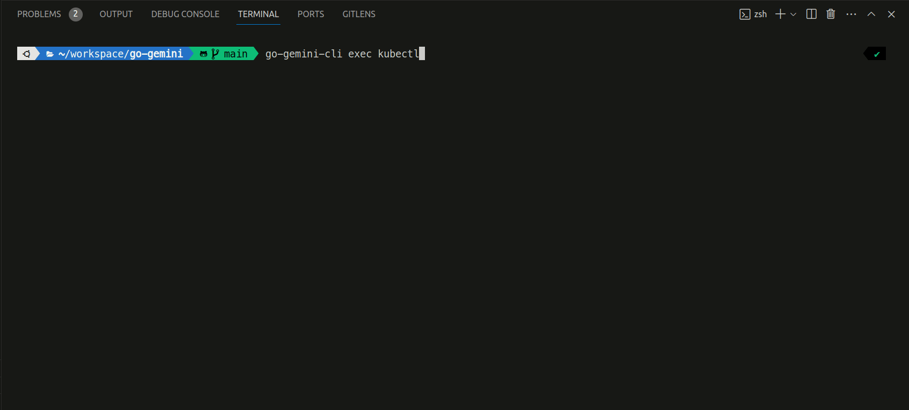

# Go Gemini CLI

Go Gemini CLI is a command-line interface (CLI) tool written in Go, utilizing [Cobra](https://github.com/spf13/cobra-cli) and [Viper](https://github.com/spf13/viper) libraries, designed to interact with the LLM Gemini API. With this CLI, you can easily configure your API key and make queries to the Gemini platform.

## Installation

To install Go Gemini CLI, you need to have Go installed on your system. Then, you can install the CLI using the following command:

```bash
go install github.com/thiagosousasantana/go-gemini-cli
```

## Usage

After installation, you can use the CLI with the following commands:

### Config

Use the `config` command to set up your API key. This command requires the API key as an argument.

```bash
go-gemini-cli config --api-key <your-api-key>
```

Replace `<your-api-key>` with your actual Gemini API key. If you do not have one you can generate on this [link](https://makersuite.google.com/app/apikey).

Running this command it will create a YML file on your `$HOME` with your configuration.

### Ask

The `ask` command allows you to make a question to the Gemini AI.

```bash
go-gemini-cli ask --query "Your question goes here?"
```

Replace `"Your question goes here?"` with your actual question.


### Exec

The `exec` command allows you to execute a shell command and get the output. If an error occurs, it will be analyzed by the Gemini AI.

```bash
go-gemini-cli exec "Your shell command goes here"
```

Replace `"Your shell command goes here"` with your actual shell command`



## Contributing

Contributions are welcome! Feel free to open issues or submit pull requests to improve the CLI.
